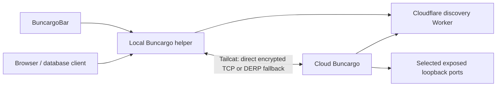

# Cloud worktree connections

BuncargoBar lists remote projects, branch/worktree names, and their exposed targets. Open gives the browser a local URL; Connect gives database tools a local TCP port. Cloud and recipient computers require neither a Tailscale account nor administrator networking setup.

## Automatic sharing

Copy a token from BuncargoBar or `bunx buncargo connect token`. Set `BUNCARGO_CONNECT_TOKENS` in the cloud environment to that token, or a JSON array of recipient tokens. Long-running dev runs automatically share all selected apps and services with a host port. No per-target `expose` setting, `--share` flag, or groups. Workers, jobs and portless containers have no endpoint to share. Apps default to HTTP, built-in presets infer the protocol, and custom services default to TCP with an optional `exposeProtocol: "http"` override. One-shot commands do not share. Existing explicit `--expose` Quick Tunnels remain a separate public-link feature.

## Architecture

The Worker stores identities, grants, project/branch metadata, opaque Tailcat addresses, ports and expiring leases. It receives no application streams. One Tailcat server per recipient/run uses an ephemeral address containing a WireGuard pre-shared key. This makes recipient revocation independent: close that server without restarting other recipients.

Tailcat handles WireGuard, NAT traversal, TCP transport and relay fallback. Buncargo manages installation and process lifecycle. Per-target loopback gates prevent a stopped app's port being reused by an unrelated process behind an existing grant. HTTP forwarding retains browser bootstrap cookies, Host/Origin validation, app authorization, SSE and HMR support. A normal HTTP agent uses real loopback sockets, allowing connection reuse without custom byte framing.

The former Worker relay, per-request access capabilities, custom WebSocket stream protocol and Tailscale discovery are removed. There is no compatibility adapter for old relay clients.

## Identity and lifecycle

- The copied registration token permits publishing, never reading other sessions or connecting as the recipient.
- The private device file contains the directory owner credential and registration token, with mode 0600. Only its owner can retrieve Tailcat addresses. Each Tailcat client uses a fresh ephemeral key, avoiding DERP identity collisions between simultaneous forwards.
- Every Tailcat publisher gets fresh ephemeral server keys and only explicit gate ports. No exit node, shell, file service, or `serve all`.
- Renew every 10 seconds. Failed renewal closes the publisher; a separate 20-second deadline after the last successful publication bounds queued or stalled requests. Discovery expires after 90 seconds.
- Revocation is enforced on the next renewal, bounded by that deadline; it is not instantaneous. It closes existing TCP/SSE/WebSocket streams. Token rotation alone leaves existing sessions authorized; `rotate --all` also revokes them.
- Reconnection starts a new Tailcat address and publishes a new revision. Interrupted HTTP requests and database transactions are not replayed. Local helper polling retires forwards to old addresses.

## Operations and release

The existing domain remains `connect.hanskristoffer.dk`. No worktree DNS records are needed. Tailcat's public DERP fleet is the initial fallback. Operators can use one self-hosted DERP server and publish a DERP map through `BUNCARGO_TAILCAT_DERPMAP_URL` on both sides. This is a server configuration, not a Cloudflare Worker traffic proxy.

The CLI automatically installs pinned, checksum-verified Tailcat binaries for Apple silicon and Linux x64/arm64. Other architectures require a compatible binary through `BUNCARGO_TAILCAT_PATH`. See [operations](connect-directory.md).

Release Please owns versions and changelogs. The Worker deploys and passes live Tailcat/HTTP/Postgres acceptance before npm and a combined menu-bar release publish. PR CI tests macOS/Linux with a real local DERP relay and forces fallback, avoiding dependence on public relay availability for regression checks.
