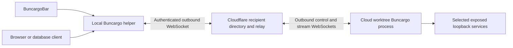

# Private cloud worktrees in Buncargo

Status: implemented. The directory and relay run at `https://connect.hanskristoffer.dk`. The CLI and menu bar ship together through the existing release workflows. See [operations](connect-directory.md) and [two-machine acceptance](connect-server-acceptance.md).

## User workflow

1. Copy a connection token from BuncargoBar, or run `buncargo connect token` on the receiving computer.
2. Save it in the cloud environment's secret `BUNCARGO_CONNECT_TOKENS`. Use a JSON array to share with several computers.
3. Run `buncargo dev` normally. Selected apps and services with `expose: true` appear in each recipient's menu bar, grouped by project and branch/worktree.
4. Choose Open for a browser app/API, or Connect for a local TCP address usable by Postgres, Redis and other single-endpoint clients. Database credentials remain the user's responsibility.

There are no groups and no `--share`. A token grants a server permission to publish to its recipient; it does not let that server read the recipient's inbox or connect to other servers. Each computer has a separate private device credential.

No tokens means no private directory or transport work. No eligible targets means no relay connection. One-shot commands ignore inherited tokens. Explicit `--expose` retains the existing public Cloudflare URL behavior; a connection token never enables public access.

## One private setup

Remove the unused Tailscale integration completely: CLI commands/flags, coordinator and Serve mappings, configuration and URL fields, menu discovery/preferences, daemon builds, package exports and obsolete documentation/tests. There is no migration or coexistence mode because users have not adopted it. Keep local named hosts, container orchestration and explicit public tunnels.

Repository removal does not uninstall a developer's own Tailscale application. SSH used during acceptance is administration only; application traffic uses the new relay.

## Architecture

Use one SQLite-backed Durable Object per recipient for both its directory and relay. Each publisher opens one outbound control WebSocket per recipient; every application connection gets its own paired stream WebSockets. All endpoints use the existing stable origin. No private cloudflared process, random tunnel hostname, incoming port, VPN or extra server installation is needed.

This replaces the early Quick Tunnel prototype, which failed ordinary cold starts when new hostnames were negatively cached by DNS. Application bytes now pass through Cloudflare's Worker relay. TLS protects both network legs; this is not end-to-end encryption against the relay operator. Applications can also use their native database TLS.

Recipients register independently. A revoked token or unavailable recipient cannot block sharing to another. The directory reports application readiness and relay availability separately; the menu displays Connecting and disables Open/Connect until both are usable.

## Credentials and access

| Credential | Held by | Authority |
| --- | --- | --- |
| Private device credential | Local computer | Read its inbox, request access, rotate token, revoke incoming sessions |
| Copyable registration token | Cloud environment secrets | Register services for that recipient |
| Per-session publisher secret | Publishing Buncargo process | Update/withdraw its registration and attach its relay sockets |
| Signed capability | Helper, relay, publisher | Access one recipient/session/target for at most 60 seconds |

Persist local secrets with mode 0600. Store only credential hashes and bounded metadata in the directory. Registration metadata excludes commands, local paths, environment variables and database passwords. Transported application bytes are forwarded, not written to directory storage or logs.

Use Ed25519 capabilities through `jose`; verify issuer, audience, recipient, target, signature and expiry at both relay and publisher. Derive endpoints from the trusted directory origin and IDs. Clients cannot supply arbitrary upstream URLs or ports. Only the publisher's selected `expose: true` target table can be dialed.

`connect rotate` changes the token for future runs; existing sessions keep their own secrets. `connect revoke --session=<id>` removes one incoming session. `connect rotate --all` revokes current sharing too. Revocation reconciles live relay streams immediately; missing authorization renewal closes streams within 60 seconds even during directory failures.

## Lifecycle and transport

- Resolve eligible targets after port preparation. Start automatic sharing only in long-running CLI dev flows; arbitrary library construction must not create a persistent publisher.
- Register with a stable endpoint, then attach the outbound publisher control socket. Keep app status starting until actual readiness succeeds.
- Renew directory leases every 30 seconds; expire after 90 seconds. Control heartbeats run every 15 seconds; relay availability expires after 45 seconds without a heartbeat.
- Retry failed publication/control connections with bounded backoff. Exiting or stopped targets close their owned streams and update discovery. Cleanup withdraws every attempted registration, including uncertain network outcomes.
- Preserve stream boundaries, byte order, backpressure and TCP half-close. Credit limits bound bytes in flight through the Worker. Stream capabilities renew every 20 seconds.
- A failed stream closes. Restored transport permits new connections; never replay database transactions or buffered application requests automatically.
- Browser Open creates an authenticated loopback proxy with a bootstrap cookie, Host/Origin checks and WebSocket/SSE forwarding. The helper owns listeners independently of menu visibility. TCP Connect binds loopback on an allocated port.

Built-in service presets infer HTTP/TCP. Custom services require `exposeProtocol: "http" | "tcp"` with `expose: true`. Native TCP covers single-endpoint Postgres/Redis and similar services. UDP, Redis Cluster redirects, additional advertised addresses, arbitrary frontend URL rewriting and remote process/filesystem control are outside this release. Prefer relative API URLs through the app's dev-server proxy.

## Menu bar and ownership

Replace Tailscale discovery with `ConnectionStore`, the authenticated directory reader and remote rows. Show project, branch/worktree, target status and transport availability. Refresh on menu opening/wake and poll with cancellation/backoff; expire unavailable sessions and disable stale actions.

Offer Copy connection token, Open, Copy URL/address, Connect/Disconnect, token rotation and session revocation. Delegate credential mutations and connections to the local CLI/helper. Never execute commands or paths supplied by remote metadata. Local process-stop actions remain local.

## Code responsibilities

| Module | Responsibility |
| --- | --- |
| `src/core/connect/protocol.ts` | Shared bounded schema, token parsing and trusted endpoint derivation |
| `src/core/connect/device.ts`, `client.ts`, `capability.ts` | Identity persistence, directory client and signed access |
| `src/connect-directory/service.ts` | Recipient grants, revisions, leases, rotation and revocation |
| `src/connect-directory/relay.ts`, `worker.ts`, `local.ts` | Shared relay engine and Cloudflare/Bun adapters |
| `src/core/connect/transport/` | Outbound publisher, framed channels and local HTTP/TCP listeners |
| `src/cli/dev-connect.ts` | Automatic publication and process lifecycle |
| `src/cli/commands/connect.ts`, `core/connect/helper.ts` | Local setup and detached connection helper |
| `menubar/Sources/` | Directory decoding, connection store and remote UI |

The local run registry remains owned by `run-publish.ts`. Private publishing must work independently of status-file writes. Keep the separately deployed Worker out of npm bundles.

## Release validation and operation

Run build, lint, the full Bun suite, Swift tests, package verification and universal menu bar smoke checks. Exercise the deployed Worker and actual two-machine CLI/helper with two recipients, expose filtering, branch metadata, HTTP/SSE/WebSockets, real Postgres/Redis, authorization renewal, revocation, publisher outage/recovery and cleanup. No DNS workaround or SSH application forwarding is acceptable.

The initial Worker uses standard WebSockets and incurs Durable Object duration while connected. Monitor usage, rate limits and reconnects; hibernation is a later optimization, not an assumed property. [Operations](connect-directory.md) records the current limits and deployment procedure. Release Please owns versions and changelogs; merge through the normal conventional-commit release workflow rather than editing version files manually.
