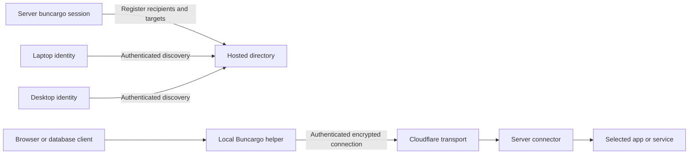

# Remote services through Buncargo connection tokens

Status: implemented in this checkout, September 8, 2026. The directory is deployed at `https://connect.hanskristoffer.dk`; the CLI and menu bar require the new source build/release. Two-machine testing found a release blocker in fresh Quick Tunnel DNS resolution; see [the acceptance report](connect-server-acceptance.md). This document records the design. See [operations and recorded acceptance](connect-directory.md) for deployed behavior and limits.

## Decision

Give each local Buncargo installation a device identity and a copyable connection token. A server with that token in its environment automatically shares its selected apps and services marked `expose: true` with that device. BuncargoBar discovers them and provides access.

There are no groups, group subscriptions, accounts or `--share` flag. One server can receive multiple connection tokens to share the same services with multiple computers. Each computer has its own private identity; a connection token authorizes publishing to that recipient, not impersonating it.

Keep `--expose` as the existing explicit public-URL feature. Token-driven sharing is authenticated recipient access. It must not silently expose an unprotected public endpoint or require `--expose` to activate.

Browser apps and HTTP APIs are the first delivery milestone. Prototype raw TCP early, then add Postgres, Redis and other single-endpoint TCP services through the same workflow. Remove Buncargo's Tailscale integration as part of this implementation. No users depend on it, so there is no coexistence, migration or deprecation phase. Recipient tokens are the single private remote-access setup.

## User experience

On the local computer:

1. Open BuncargoBar and choose **Copy connection token**.
2. Buncargo initializes a device identity if this is the first use.
3. Save the token in the server or cloud agent's environment secrets.

The CLI provides an equivalent setup/token command for users without the menu bar, plus status, token rotation and sharing-revocation commands. The `buncargo connect` command spec defines `token`, `status`, `rotate`, `revoke`, `open` and `disconnect`; there is no per-run sharing command to remember.

Use one environment variable, read through `src/core/runtime-flags.ts`:

```text
BUNCARGO_CONNECT_TOKENS=<connection-token>
```

For several recipient computers, accept a JSON array in the same variable:

```json
["<laptop-connection-token>", "<desktop-connection-token>"]
```

In the existing dev configuration, mark the intended targets:

```ts
// Illustrative fragments of existing app/service entries:
web: { /* existing app configuration */ expose: true }
api: { /* existing app configuration */ expose: true }
postgres: { /* existing service configuration */ expose: true }
```

Then start normally:

```sh
bunx buncargo dev
```

The recipient's menu bar shows the project and worktree automatically. HTTP targets have Open and Copy URL actions. Database targets have Connect and local connection details, with Open in TablePlus where supported.

## Activation and target selection

Resolve eligibility as the intersection of targets selected by the normal dev startup plan and targets with `expose === true`. This includes selected required services, and apps the invocation starts or legitimately reuses. Do not start an otherwise unselected app merely because it is exposable.

| Inputs | Behavior |
| --- | --- |
| No tokens, no `--expose` | Local development only; no remote discovery, directory or connector work. |
| Tokens present, eligible targets exist | Automatically establish authenticated sharing to those recipients. |
| Tokens present, no eligible targets | Continue ordinary startup and report that no selected targets have `expose: true`; start no connector. |
| `--expose` without tokens | Existing public exposure behavior. |
| Tokens and `--expose` | Share eligible targets privately and independently honor the explicit public target selection. Clearly distinguish the two sets of URLs. |

Additional rules:

- A missing variable, whitespace-only value or empty JSON array disables token sharing. Parse a nonempty value as one opaque token or a JSON array of nonempty token strings. Reject malformed input before startup mutations and never include its value in the error.
- Deduplicate identical tokens. Resolve tokens to recipient identities and publish at most one registration per recipient for this run, even if multiple valid tokens address the same device.
- `expose: false` or an absent `expose` property excludes a target. All recipients receive the same eligible target set initially; no per-recipient target configuration is needed.
- Automatic sharing works in CI/cloud environments when tokens are present. Do not disable it through the existing CI gates for named hosts or local onboarding.
- Tokens affect the long-running dev flow. Commands such as build, typecheck, inspect, seed and one-shot teardown do not share anything simply because they inherit the environment variable.
- Distinguish HTTP and TCP explicitly using service preset metadata or a typed protocol setting for custom targets. Do not guess solely from a port number. Before TCP is supported, report an actionable preflight error for an eligible unsupported TCP target; never forward a database through an HTTP endpoint or silently claim it is shared.
- Remove automatic Tailscale activation and its CLI flags and commands. The normal unknown-flag/command handling applies to removed options; no compatibility aliases or fallback mode are needed.
- Private and explicitly public exposure have separate ownership. Creating a public URL must not become an authentication bypass for another target. A target deliberately selected for public exposure remains public even if it is also shared privately.

## Architecture



The hosted directory stores device records, registrations, access grants and freshness metadata. Application traffic travels through the connector transport, not through the directory. Both devices and servers make outbound connections, so neither needs a publicly reachable incoming port.

Create one set of connector tunnels per run/target layout, independent of recipient count. Adding another recipient changes authorization, not application URLs or tunnel count. Register recipients independently so one invalid token or unavailable recipient record does not block the others.

A local helper owns authenticated browser proxies and TCP listeners independently of the menu being open. BuncargoBar stays a reader of status and delegates setup, connection and credential mutations to CLI/helper commands. A browser cannot attach the device's private credential itself; Open uses a local authenticated proxy rather than opening an unprotected connector URL.

Use a Cloudflare Worker with SQLite-backed Durable Objects for the directory. Start with one object per recipient to serialize its tokens and incoming registrations without cross-recipient transactions. Keep authorization issuance and revocation in the same scope. This is the deployed hosting setup; library consumers do not need to operate their own Cloudflare account. [Durable Object storage documentation](https://developers.cloudflare.com/durable-objects/api/sqlite-storage-api/)

Use HTTP polling for discovery initially; a WebSocket data transport does not require WebSocket directory subscriptions. Defer account syncing, team administration, invitation emails and a separate web app. Deployment still needs rate limits, storage bounds, monitoring and recovery procedures.

## Identity, tokens and access

| Credential | Where it lives | Authority |
| --- | --- | --- |
| Private device credential | Local installation only | Authenticate as this recipient, discover its services, request connections, rotate its connection token and revoke incoming registrations. |
| Connection token | Copied to server environment secrets | Register services for its embedded recipient identity and authorize that recipient to connect to those targets. Cannot read the inbox, impersonate the device, or connect to other servers. |
| Publisher/session credential | Created by the running server | Update, renew and withdraw its own recipient registration. Cannot claim or modify another publisher's registration. |
| Short-lived connection capability | Local helper, presented to server connector | Connect as one recipient to one live session and target, subject to expiry and revocation. |

The public device ID identifies a recipient but grants no authority by itself. The copied token combines an opaque recipient reference with a high-entropy registration secret. Send it only to the configured trusted directory; do not let arbitrary token contents choose a credential destination or executable command.

Registration is the server's explicit grant of access to the device represented by the token. The directory issues connection capabilities only after authenticating that device and checking a live grant. The server connector verifies issuer/signature, recipient, session, target, audience and expiry before opening an upstream connection. Use an established signing scheme and library rather than inventing cryptography.

All connector routes require authentication before forwarding application bytes, including HTTP requests and WebSocket upgrades. Map target IDs to the server's configured endpoints; clients cannot request arbitrary hosts or ports. An unguessable URL is not access control.

Store registration-token and bearer-credential hashes server-side, and protect private device material locally using existing state paths, private permissions, atomic writes and locks. Keep tokens out of argv, logs, timing output, fixtures, URLs and directory snapshots. Do not forward authorization across redirects.

Define separate operations for:

- **Rotate connection token:** invalidate the old token for new registrations. Existing live registrations continue through their session credentials; restarted servers need the new token.
- **Revoke a registration:** remove access to a specific shared session and reject further renewals. The recipient may still receive a genuinely new registration from a server that retains a valid connection token.
- **Revoke all and rotate:** invalidate current registrations and prevent holders of the old token from registering again. This is the recovery action for a leaked token.
- **Server withdrawal:** revoke that session's grant to one recipient without changing other recipients or shutting down shared tunnels.

Use short leases/capabilities and enforce a documented maximum revocation delay for new and existing connections. The connector must revalidate long-lived access within that bound and close it if authorization cannot be renewed. Directory outages may leave local apps running but must not permit indefinite stale remote authorization.

Device credentials are not synced between computers in this version. A second computer receives its own token; a lost identity requires re-pairing servers. Copying a token into a cloud image must not also clone a publisher/session identity across all its worktrees.

## Network contract and lifetime

Create a separate versioned schema rather than uploading `runs.json`. Publish only:

- Fresh random session ID per dev invocation, shared across recipient registrations.
- Project, worktree and branch display labels; optional provider label.
- Primary app reference when it belongs to the shared selection.
- Target ID, kind (`app` or `service`), protocol (`http` or `tcp`), name and status.
- Connector endpoint and transport metadata, plus a monotonically increasing snapshot revision.

The directory adds recipient ID, registration ID, generation, server timestamps and lease expiry. Omit filesystem paths, PIDs, commands, environment values, repository credentials and database connection strings. The recipient constructs local connection URLs after opening a forward; they are not server-published browser URLs.

Bound labels, collections and message sizes. Validate connector HTTPS/WSS endpoints without embedded credentials against the chosen provider's explicit URL policy. Do not fetch arbitrary publisher-provided URLs for server-side health checks. Keep the schema independent of the private local registry; the removed Tailscale directory protocol does not need a compatibility layer.

Publishing lifecycle:

1. Parse tokens, resolve eligible targets and validate supported protocols before startup mutations.
2. Start the run's connector with only the eligible upstreams and establish transport endpoints.
3. Register each recipient independently with publisher proof and idempotency protection. A token holder cannot overwrite a registration by guessing another session ID.
4. Publish URLs/connector metadata as they become available and preserve `starting` until readiness succeeds. Forward app exits, tunnel failures and target changes promptly.
5. Serialize updates per registration and renew every 30 seconds with an initial 90-second server-timed lease. Retry transient failures with capped backoff and jitter; stop retrying revoked/invalid authorization and report the affected recipient without exposing its token.
6. On shutdown, cancel new work, bound withdrawal attempts for each recipient and close owned tunnels through existing teardown. Other dev sessions must retain their own grants and tunnels.

`run-cli.ts` currently publishes the local run before `dev-tunnels.ts` opens public tunnels. Observe actual connector/tunnel completion and readiness events rather than copying the initial status file. Remote publication must not depend on successful local registry writes, and the local registry remains owned by `run-publish.ts`.

Reject older snapshot revisions. Generation fencing or bounded terminal tombstones must prevent delayed heartbeats from reviving withdrawn registrations. Heartbeats renew existing records; explicit re-registration after expiry requires valid registration authorization. Filter expired grants on directory reads even before background storage cleanup.

Keep status meanings distinct: publisher heartbeat is liveness, app readiness is target health, and tunnel state is transport availability. Report partial recipient failures while continuing useful startup. Never present a failed private connection as a public fallback.

## HTTP and TCP transport

Prototype an authenticated Buncargo connector carried over Cloudflare. Reuse existing cloudflared download, process ownership, cancellation and tunnel lifecycle code where applicable. Reuse of infrastructure does not mean pointing an existing unprotected public tunnel directly at private upstreams.

For HTTP, the local helper forwards browser requests through authenticated transport. Establish a coherent frontend/API mapping per recipient; keep server-internal loopback addresses separate from browser-facing URLs. Prove CORS, redirects, cookie isolation, Vite host checks and HMR with two worktrees and two recipients. Do not assume that passing a single public URL into the current app environment is sufficient for multiple recipient-local origins.

Use separate loopback listeners per remote target initially, with existing named-host support considered only where it improves the browser experience. Bind only to loopback and allocate collision-free ports. Protect the local proxy against untrusted browser origins/Host headers and cross-site WebSocket abuse; loopback binding alone is not browser authentication. Keep private credentials in the helper, never in frontend JavaScript or query strings.

For TCP, the same helper exposes a local port:

```text
psql / TablePlus / redis-cli
  -> 127.0.0.1:<allocated local port>
  -> authenticated transport
  -> server connector
  -> selected Postgres / Redis / TCP service
```

Key forwards by remote session and target, not the database's default port. The helper owns them until explicit disconnect, expiry or shutdown, independent of the menu UI. Keep database credentials out of discovery; users supply native database credentials through their client.

Compare two transport implementations before committing:

| Option | Benefit | Work to prove |
| --- | --- | --- |
| Buncargo TCP-over-WebSocket bridge through Cloudflare | Fits copied-token onboarding without separate VPN enrollment. | Authentication, binary framing, buffering/backpressure, half-close, lifetime and endpoint compatibility. |
| Named Cloudflare Tunnel with client-side `cloudflared access tcp` | Reuses existing TCP forwarding code. | Automated named routes, scoped Access/connector credentials, local clients, long-lived connection reliability and integration with recipient authorization. |

Cloudflare documents that published TCP applications require client-side `cloudflared access tcp` and recommends Client-to-Tunnel for long-lived connections. Do not assume Quick Tunnels offer native database connectivity. [Published application protocols](https://developers.cloudflare.com/cloudflare-one/networks/connectors/cloudflare-tunnel/routing-to-tunnel/protocols/)

Start a custom bridge prototype with one WebSocket per TCP connection, not a multiplexing protocol. Bound sockets and buffers, preserve byte order and half-close behavior, and explicitly fail broken streams. Reconnect for new connections; never replay database commands or claim to restore interrupted transactions.

Preserve native database TLS when configured, including certificate-name verification through local forwards. Do not disable verification to hide hostname mismatches. TLS to Cloudflare is not by itself end-to-end encryption that excludes Cloudflare from application plaintext.

Quick Tunnels have a 200 in-flight request limit and do not support SSE. Direct HTTP proxying inherits those limits. A custom framed stream transport may behave differently, but SSE support must be proven through the actual implementation rather than assumed. Named tunnels or another supported transport are alternatives if required behavior fails. [Quick Tunnel limitations](https://developers.cloudflare.com/cloudflare-one/networks/connectors/cloudflare-tunnel/do-more-with-tunnels/trycloudflare/)

## Menu bar integration

Replace the Tailscale discovery store with a recipient directory client and `ConnectionStore`. Poll the authenticated device inbox roughly every 15 seconds, refresh when the menu opens and after wake, and use cancellation/backoff for failures.

Show cloud/remote sessions grouped by project and worktree with optional provider labels. Deduplicate by directory origin and server session identity, never by branch, project or endpoint. Display one row per remote session on each recipient computer. There are no group badges or subscription lists.

Use Open/Copy URL for an established authenticated HTTP proxy and Connect/Disconnect for TCP. Do not copy raw connector endpoints as usable public links. Add Copy connection token, token rotation, incoming-session revocation and status to setup/settings through the CLI/helper seam. Do not offer remote process stop or filesystem actions in this release.

On fetch failure, keep the last successful snapshot explicitly marked disconnected; disable unavailable connection actions and retire expired entries after a bounded grace period. A successful response removing a registration removes access immediately from the UI. Access enforcement also happens in the connector, independent of UI refresh.

Remove Tailscale peer discovery, directory decoding, preferences, settings and status messages. Validate recipient registrations and connector endpoints through the new protocol. Reuse useful remote row components with the new data model; there is only one remote discovery source.

## Code changes

| Area | Responsibility |
| --- | --- |
| `src/core/connect/` | Device/token storage, versioned protocol, directory HTTP client, target projection, per-recipient publisher state and capabilities. |
| `src/core/connect/transport/` | Server connector and local HTTP/TCP forwarding, with injectable I/O and bounded lifecycle handling. |
| `src/cli/dev-connect.ts` | Automatic env-driven sharing composed with selection, readiness and teardown. |
| `src/cli/commands/connect.ts` | Device setup, token copying/rotation, status, revoke and helper connection operations; not a required startup command. |
| `src/core/runtime-flags.ts`, `src/core/state-paths.ts` | Token parsing and canonical private state paths. |
| Command specs, registry and help | Setup commands and clear documentation of automatic sharing; no `--share` or group flags. |
| `src/cli/run-cli.ts`, `src/cli/dev-tunnels.ts` | Lifecycle callbacks and transport reuse while keeping explicit public exposure separate. |
| Config/types and service identity | Protocol metadata for HTTP/TCP targets without changing the `expose: true` opt-in. |
| `src/connect-directory/` | Worker/Durable Object server, deployed separately and excluded from the npm client bundles. |
| `menubar/Sources/BuncargoBar/`, `menubar/fixtures/` | Authenticated recipient discovery, helper status/actions and shared TypeScript/Swift schema fixtures. |
| Existing Tailscale modules and integrations | Remove coordinator/runtime code, CLI entry points, startup hooks, URL fields, menu bar discovery, bundle/build wiring and obsolete tests/docs as detailed below. |

Integrate with the CLI's process-owned lifecycle first. Do not silently introduce a persistent publisher into arbitrary `createDevEnvironment()` calls; programmatic integration should use an explicit lifecycle API if added. Ordinary CLI runs with no tokens must not pay for network discovery or connector initialization.

## Delivery sequence and acceptance

1. **Transport spike:** prove authenticated browser access and a Postgres/Redis forward through a real cloud sandbox, including long-lived connections. Choose the transport for the single recipient-token setup.
2. **Remove Tailscale:** delete the unused integration and its CLI, menu bar, build and documentation surfaces. Preserve local named hosts and explicit public Cloudflare exposure.
3. **Identity and directory:** implement recipient identities, copyable tokens, per-session grants, independent registration, expiry, capability issuance, rotation/revocation and the shared schema fixture.
4. **Automatic HTTP sharing:** activate from `BUNCARGO_CONNECT_TOKENS`, intersect selected targets with `expose: true`, connect lifecycle events, and support two recipients without duplicating tunnels.
5. **Menu bar and helper:** implement authenticated discovery, Open, local proxy lifecycle, status and token management. Release browser/API support only after its private transport works; do not substitute a public-directory-only implementation.
6. **TCP support:** expose local forwards and client actions under the same automatic selection rules after the transport tests pass. No new `--share` switch or token format is needed.
7. **Release:** publish compatible directory, CLI and menu bar versions with recipient tokens as the sole private remote-access setup. Document token setup for both ordinary development computers and cloud sandboxes.

Required tests include:

- A plain `buncargo dev` with tokens shares exactly the selected `expose: true` targets. No tokens or an empty array means local development unless public `--expose` is explicitly requested. CI works, while inherited tokens do nothing in unrelated/one-shot commands.
- Plain single-token and JSON multi-token parsing, duplicate recipients, malformed input, zero eligible targets, and unsupported protocols behave as documented without leaking secrets.
- Explicit public `--expose` behavior remains compatible, including when tokens are present. Private sharing never falls back to an unprotected public target.
- Two recipients reach the same sandbox through one set of tunnels; one revoked or invalid recipient does not interrupt the other.
- A connection token cannot read the recipient inbox, impersonate the device or connect to services from other servers. Target/session/recipient substitutions and expired capabilities are rejected before opening upstream sockets.
- Rotation prevents new registrations with the old token while preserving existing grants; revoke-all-and-rotate invalidates both. Active access ends within the documented revocation bound, including directory outages.
- Identical project/branch labels across sandboxes remain separate. Restarted sessions, delayed URLs, reused apps, tunnel failure, out-of-order writes and abrupt sandbox death are represented correctly.
- Browsers load the frontend and call its API through authenticated local proxies with working redirects, cookies, CORS, HMR/WebSockets and required streaming. Test concurrent worktrees and recipients with different local port allocations.
- Postgres queries, transactions, COPY/large dumps and idle pools; Redis commands, blocking operations and Pub/Sub; port collisions, backpressure, half-close, reconnect and sleep/wake work or fail explicitly. Single-endpoint forwarding does not imply support for Redis Cluster or protocols advertising extra addresses.
- Local registry and named-host behavior continue to pass their tests. New recipient fixtures replace Tailscale fixtures, and no CLI startup, menu bar refresh or build reaches for Tailscale or its coordinator.

Run the repository's required build/lint/test checks for implementation changes, plus relevant Swift tests and menu bar smoke checks. Keep external cloud transport acceptance explicit rather than making unit tests depend on public tunnels. Document cloud environment secrets and restricted outbound network setup. Monitor hosted capacity, error rates and cleanup before release.

## Remove the unused Tailscale integration

Delete the Buncargo integration within this work, with no migration tooling, compatibility adapters, deprecated commands or dual-provider configuration. No users use it yet. Transport acceptance remains a release requirement for the new feature, not a reason to retain a second setup.

The removal includes:

- `src/core/tailnet/` and its coordinator, Serve mapping ownership, discovery, state, health, diagnostics, installation and service bundles.
- `src/cli/dev-tailnet.ts`, `src/cli/commands/tailnet.ts`, `src/cli/tailnetd.ts`, and associated startup, readiness, shutdown and command-registry wiring.
- Tailscale-specific CLI flags, environment getters, configuration/types, exported APIs, URL fields such as `tailnetUrls`, state paths and banner/status output. Remove consumers as well as definitions; do not leave empty compatibility exports.
- Coordinator build entry points, package exports, installation scripts and release artifacts. Keep shared helpers still used by named hosts, Cloudflare or the new connector.
- Menu bar Tailscale subprocess calls, peer polling, directory validation, machine preferences and setup controls. Replace their useful UI with recipient discovery and token setup.
- Tailscale-only tests and fixtures. Add recipient equivalents for reusable remote UI behaviors, while preserving independent local registry tests.
- Tailscale setup instructions and the obsolete Tailscale plan/review/acceptance documents. Update README, contributor guidance and any remaining examples to describe the single token-based setup.

Repository removal does not uninstall or reset a developer's own Tailscale application. Any development-machine cleanup of Buncargo's old coordinator or owned mappings is a separate local maintenance action, not a shipped migration feature.

Finish by checking for stale imports, commands, build entries, generated help and user-facing references. The resulting product has local development, explicit public `--expose`, and automatic authenticated sharing from connection tokens; Tailscale is not an available Buncargo backend.
