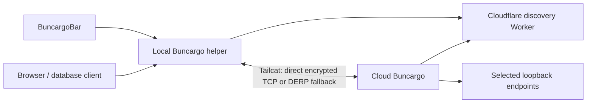

# Cloud worktree connections

BuncargoBar lists remote projects, branch/worktree names, and available apps and services. Open gives browsers a local URL; Connect gives database tools a local TCP port. Cloud and recipient computers need neither a Tailscale account nor administrator networking setup.

## Sharing

Copy a token from BuncargoBar or `bunx buncargo connect token`. Set `BUNCARGO_CONNECT_TOKENS` in the cloud environment to that token, or a JSON array of recipient tokens. Long-running dev runs share all selected apps and services with a host port. Workers, jobs and portless containers have no endpoint to share; one-shot commands do not share.

Apps default to HTTP, built-in presets infer the protocol, and custom services default to TCP with an optional `exposeProtocol: "http"` override. The `expose` config option is deprecated and has no effect on token sharing. It still selects targets for the separate public Quick Tunnel `--expose` command.

## Architecture

The Worker stores credentials and expiring discovery metadata. Application bytes travel through Tailcat, which owns WireGuard, NAT traversal, TCP backpressure and DERP fallback. Buncargo owns process lifetimes, selected loopback ports and browser access. No custom Worker traffic relay or compatibility adapter remains.

The default fallback is `derp.hanskristoffer.dk` on Hetzner. The same Worker serves the public `/derpmap.json` routing map. Publishers embed the selected relay's details in each private Tailcat address, so receivers discover the route without a matching map setting. Direct peer connections remain preferred. Worker map updates ship before the CLI in the existing release pipeline.

## Code ownership

| Module | Responsibility |
| --- | --- |
| [`cli/dev-connect.ts`](../src/cli/dev-connect.ts) | Coordinate selection, status publication, recipient renewal and shutdown. |
| [`connect/targets.ts`](../src/core/connect/targets.ts) | Select this run's endpoints and use resolved worktree ports. |
| [`connect/protocol.ts`](../src/core/connect/protocol.ts) | Define directory types, limits, validation and bounded JSON reading for both requests and responses. |
| [`connect-directory/service.ts`](../src/connect-directory/service.ts) | Authorize directory operations against recipient storage; Worker and local adapters serialize requests. |
| [`connect/tailcat/`](../src/core/connect/tailcat/) | Resolve the pinned asset through the shared tool installer, own child processes, and gate publisher ports. |
| [`connect/helper.ts`](../src/core/connect/helper.ts) | Run the authenticated local control server and serialize UI actions with directory polling. |
| [`connect/forwards.ts`](../src/core/connect/forwards.ts) | Own listeners and browser peers per session; reconcile stopped or replaced targets. |
| [`connect/transport/local-forward.ts`](../src/core/connect/transport/local-forward.ts) | Compose each local TCP or HTTP listener with its Tailcat client. |
| [`connect/transport/browser-access.ts`](../src/core/connect/transport/browser-access.ts) | Authorize browser requests, handle bootstrap/preflight, and strip private cookies upstream. |
| [`connect/transport/sockets.ts`](../src/core/connect/transport/sockets.ts) | Track sockets, bridge half-open TCP streams, and bind ephemeral loopback listeners. |

## Invariants

- Copied tokens permit registration only. Device owner credentials alone retrieve Tailcat addresses, which contain a pre-shared key and must never enter logs.
- One ephemeral publisher per recipient/run makes revocation independent. Each local forwarding process uses a fresh client key; shared client keys cause DERP identity collisions.
- Publisher gates retain the live target status. Stopping a target closes existing sockets and prevents an unrelated process from becoming reachable when it reuses the app's port.
- Publication and renewal share one queue per recipient. A separate authorization deadline closes the publisher even if that queue stalls.
- Local helper actions and polling share one queue. HTTP siblings share browser access only within their remote session; port, protocol or Tailcat address changes retire the old listener.
- Teardown closes listeners, HTTP agents, upgraded sockets and child processes. TCP half-close remains intact; SSE and HMR have no proxy idle deadline. Interrupted requests and transactions are never replayed.
- Browser cookies authorize the local listener. App Authorization headers remain intact, and device credentials never enter the browser. The menu executes local CLI commands, never paths supplied by remote metadata.

Deployment, credential rotation, limits, supported platforms and test commands are maintained in [connection operations](connect-directory.md). [Acceptance results](connect-server-acceptance.md) record the two-machine and database tests already performed.
