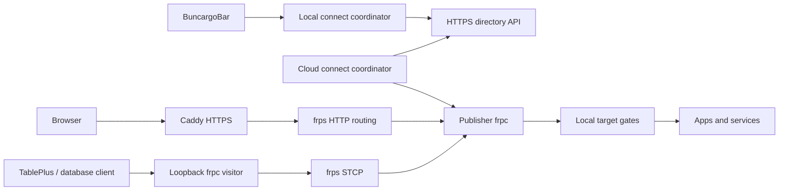

# Replace Tailscale sharing with frp

Status: replacement acceptance plan. The implementation is tracked in this branch; `docs/frp.md` describes its user and operator interfaces. Live acceptance results must be recorded before release.

## 1. Outcome and scope

Buncargo will share running development environments through our Hetzner server using frp. A developer copies a recipient token from BuncargoBar into a cloud environment, starts `buncargo dev`, and sees that environment's apps and services in the topbar. Apps open at public HTTPS URLs. Database tools connect through private, local TCP listeners.

There will be one remote-sharing implementation. Delete Tailscale discovery, installation, enrollment, Serve mappings, certificate handling, transport, commands, fixtures, and CI jobs. Do not introduce a transport selector, compatibility layer, old-state reader, migration command, or fallback to Tailscale, Tailcat, DERP, or Cloudflare tunnels.

The existing local development features remain: container orchestration, named `.localhost` URLs, mkcert, worktree ports, run registry, process ownership, and shared menu row components. The independent, explicitly requested Cloudflare public-tunnel command remains outside this replacement; it must not participate in automatic remote sharing. Update its documentation to make that boundary clear.

## 2. Evidence and performance target

On 10 September 2026, the same running Lullu Vite server in Cursor was tested from the MacBook Pro in Denmark. Three sequential runs per route were alternated, browser cache was disabled, and both routes used HTTP/2 without asset compression.

| Median measurement | frp through Hetzner | Tailscale through observed New York DERP |
| --- | ---: | ---: |
| Identical 20 MiB file | 3.00 seconds | 45.59 seconds |
| Browser load event | 5.46 seconds | 71.76 seconds |
| Main heading visible | 7.48 seconds | 80.22 seconds |

All file downloads returned HTTP 200 with the same checksum. Browser runs transferred approximately 38.7 MB across 1,209–1,211 requests without resource HTTP errors. A real Vite HMR WebSocket connected. A separate controlled fixture verified incremental SSE and WebSocket echo; the application's own subscriptions and a source-edit HMR cycle still need testing.

This supports replacing the observed relay path. It does not establish an advantage over direct Tailscale, nor guarantee line-rate throughput. Hetzner bandwidth, geographical distance, the sandbox uplink, app compilation, and concurrent users still matter.

The benchmark used a private TCP proxy behind Caddy. Production will use frp's native HTTP hostname routing to avoid allocating server ports or changing Caddy configuration for every app. Repeating the benchmark through that exact production path is a release gate, not an assumption that both paths perform identically.

## 3. User-facing contract

### Setup and automatic publication

1. Install BuncargoBar or run `buncargo connect token` locally. This creates a receiver identity once and returns its share token.
2. Copy the token into the cloud environment's secrets. It is a credential, not a public computer ID.
3. Optionally set a display name, then start the ordinary dev command:

```sh
export BUNCARGO_CONNECT_TOKENS='bc_share_example_one,bc_share_example_two'
export BUNCARGO_CONNECT_NAME='Cursor cloud'
bunx buncargo dev
```

The example values are placeholders. Parse tokens as comma-separated values, trim surrounding whitespace, discard empty entries, and deduplicate. Do not support competing JSON, shell-word, or semicolon formats. A malformed nonempty token produces a clear, redacted configuration error. A rejected recipient is reported individually; valid recipients can still receive the run.

When tokens are present, automatically publish every selected app and service that has a reachable host port. Skip workers, jobs, unselected targets, and stopped targets. Never use `expose` as a publication filter and do not add `--share`. Without tokens, dev stays local and starts no publisher or tool download.

`BUNCARGO_CONNECT_NAME` is display metadata, not an authorization group. Trim it and limit it to 80 characters. If omitted, use the publisher hostname. Two runs named `Cursor cloud` appear together even when they came from different sandboxes. Project, branch, worktree, and opaque run identity remain separate fields; duplicate branch names must not merge distinct runs.

Read these variables through `runtime-flags.ts`. Remove the sharing tokens from the environment passed to app child processes; only the coordinator needs them. Do not inject tokens into frontend `define` values, generated public files, terminal banners, telemetry, or process arguments.

### CLI and menu actions

| Surface | Behavior |
| --- | --- |
| `connect token` | Create/reuse receiver identity and print its publish-only share token. |
| `connect status [--json]` | Report directory health, publication status, received runs, and local TCP connections with actionable errors. |
| `connect open <target-id>` | Open an app's validated public HTTPS URL. |
| `connect tcp <target-id> [--json]` | Ensure a private visitor and return its actual local address and connection URL. |
| `connect disconnect <target-id>` | Close this computer's TCP visitor, leaving the publisher running. |
| `connect revoke <share-id>` | Revoke this receiver's access relationship with that publication. |
| `connect token --rotate` | Replace the publish-only token; existing grants require separate revocation. |

Generate parsing, validation, and help from the repository's command-spec primitives. JSON must be a validated schema shared with the bar, not human output parsed by Swift. No `tailnet` command alias remains.

BuncargoBar groups remote runs by connection name, then project. Each environment row shows its branch/worktree and uses the same status, primary-app Open action, detail panel, APPS/SERVICES sections, URL display, copy icon, and TablePlus affordance as local rows. Do not duplicate row rendering.

HTTP Open and Copy use `https://<opaque-target>.connect.hanskristoffer.dk/` directly. They must not start a local browser proxy. TCP Connect, Copy connection URL, and TablePlus first ensure a local visitor; they use its actual `127.0.0.1:<port>`. Show connecting/error/connected states instead of claiming a database is ready before the connection succeeds. Disconnect is a local action; it must not masquerade as stopping the remote process.

## 4. Architecture

Deploy three processes on the existing Hetzner machine at `178.104.193.175`:

| Component | Responsibility |
| --- | --- |
| Caddy | Public HTTPS, wildcard certificate renewal, forwarding API requests and app traffic. |
| frps | HTTP hostname routing and private STCP transport to publisher/visitor clients. |
| Small Bun service with SQLite | Receiver identities, grants, run directory, leases, target allocation, and frps authorization hooks. |



The directory is not in the application response-body path. Do not build another HTTP/SSE/WebSocket proxy in Bun. Local gates enforce process ownership and lease expiry while streaming bytes with backpressure.

Use pinned frp v0.71.0 as the starting version because it was tested. Verify downloads against committed official checksums for Linux amd64/arm64 and macOS arm64/amd64. Keep version and checksums in one module. Installation is automatic and unprivileged; no VPN, TUN device, root, sandbox image changes, or interactive login is required. Verify outbound TLS/TCP access to the chosen frps port in each supported cloud environment.

## 5. DNS, certificates, and transport

Create two DNS-only Cloudflare records pointing at Hetzner:

| DNS name | Purpose |
| --- | --- |
| `connect.hanskristoffer.dk` | Directory HTTPS and frpc server identity. |
| `*.connect.hanskristoffer.dk` | All published browser apps and APIs. |

Give each HTTP target a random, server-allocated single DNS label. Keep it stable for the lifetime of that run; never derive uniqueness or authorization from a branch name. A new run gets new IDs. Never reassign a retired hostname to another run.

Caddy obtains the apex and wildcard certificates with DNS-01 using a pinned build containing its Cloudflare DNS provider. Store a zone-scoped DNS token only on the server. Persist certificate storage and renew automatically; no per-worktree DNS records, certificate requests, or Caddy config updates. [Caddy certificate automation](https://caddyserver.com/docs/automatic-https)

Route the apex to the directory API. Route the wildcard to frps's private HTTP listener, preserving the hostname for frps to select the target. Configure frps `subDomainHost` and each allocated proxy's `subdomain`; do not allow arbitrary client-supplied domains. [frp subdomain routing](https://gofrp.org/en/docs/features/http-https/subdomain/)

Initially expose TCP 443 for HTTPS, TCP 7000 for frpc TLS, and optionally TCP 80 for HTTPS redirects. Keep frps HTTP routing, authorization hooks, and all administration listeners on loopback or an isolated service network. There are no public database ports. Configure the host and Hetzner firewalls consistently.

Require frpc TLS and verify the server certificate and DNS name; do not rely on encryption without identity verification. Install the apex certificate into frps-readable private files through a tested renewal hook and reload/restart frps when it changes. A renewal may reconnect clients; test recovery and keep certificate keys out of artifacts and client configs. [frp TLS configuration](https://gofrp.org/en/docs/features/common/network/network-tls/)

Start with TCP transport, TCP multiplexing enabled, and transport compression disabled, matching the benchmark's defaults. Record those settings explicitly in generated configurations and benchmark results. Do not add QUIC, UDP traversal, XTCP, automatic protocol selection, or additional relay regions in the first implementation.

## 6. Identity, authorization, and minimal directory API

### Separate publishing from reading

Creating a receiver returns two independent random 256-bit capabilities:

- A private owner credential, stored locally with mode `0600`, for reading that receiver's directory and managing its tokens/grants.
- A publish-only share token, safe to put in the intended sandbox's secret store. Possession authorizes adding a publication to this receiver; it does not authorize listing its other runs, retrieving database credentials, creating visitors, or revoking other publications.

Store capability hashes in SQLite and compare securely. Token prefixes identify purpose; they are not authentication. Rate-limit identity creation and publication, cap targets and metadata sizes, and redact credentials from all HTTP/frp logs. Enrollment is intentionally accountless in this first version; its public endpoint needs quotas before deployment.

The client generates a separate publisher-session credential before registration, which returns it in the lease response. This makes a retried registration idempotent even if its first response was lost. A publisher may update/delete only its own run and only the recipients authorized at registration. The receiver can revoke a run grant even if the publisher still knows the share token: retain that revoked relationship for the publication lifetime so heartbeats cannot recreate it. Rotate the share token to stop future registrations by a sandbox that knows it.

An app URL is public to anyone who knows it. Recipient tokens govern discovery and private TCP access; they do not turn an app URL into an authenticated endpoint. Existing app authentication remains responsible for browser access. Do not place database credentials or recipient metadata in public responses.

### Data model

Use one SQLite database with transactions, unique constraints, and a server-generated clock for leases:

| Entity | Essential fields |
| --- | --- |
| Receiver | ID, owner credential hash, share token hash, token generation, created time. |
| Publication | ID, publisher credential hash, idempotency key, display name, project, branch, worktree, run ID, lease deadline. |
| Grant | Publication ID, receiver ID, active/revoked state. |
| Target | ID, publication ID, name, kind, protocol, preset, readiness, allocated hostname or TCP proxy identity. |
| Visitor grant | Receiver, target, session credential hash, proxy generation, deadline. |

Keep raw database connection metadata accessible only to its publisher and authorized receivers. Where the server must return a secret, such as an STCP key, encrypt it at rest with a server-only key; it cannot be recovered from a hash. Persist identity/grant data across server restarts. Expired publications are hidden immediately and garbage-collected with bounded retention. Restored backups must not resurrect live publication leases.

Use these API responsibilities, with a versioned JSON schema and explicit error codes:

| Endpoint | Authentication and purpose |
| --- | --- |
| `POST /v1/receivers` | Rate-limited bootstrap; returns owner credential and share token once. |
| `POST /v1/receiver/token` | Owner; rotate its share token. |
| `GET /v1/receiver/runs` | Owner; return only active grants and current targets. |
| `DELETE /v1/receiver/grants/:id` | Owner; revoke its grant. |
| `POST /v1/publications` | Share tokens; register an idempotent run and return accepted/rejected recipients plus publisher credential. |
| `PUT /v1/publications/:id` | Publisher; renew lease and reconcile its selected targets. |
| `DELETE /v1/publications/:id` | Publisher; retire its run. |
| `POST /v1/targets/:id/visitor` | Owner; issue/renew an authorized private TCP visitor descriptor. |
| `POST /internal/frp` | Private frps callback listener; never exposed by Caddy. |
| `GET /healthz` | Public, non-sensitive process health; no directory contents. |

Never accept a client-provided arbitrary upstream URL or shell command. The cloud client maps its own run-registry target to loopback. The server allocates hostname/proxy identities and validates every change. The local CLI validates received HTTPS origins, IDs, protocols, and generated loopback visitor addresses before handing actions to Swift.

### frps authentication integration

Use stock frps with a mandatory local authorization plugin. Bind each authenticated frpc session to a directory-issued capability, role, publication/visitor identity, and current lease. Validate Login, NewProxy, Ping, and NewWorkConn; reject unknown sessions, expired grants, wrong names/domains, unallocated proxies, and all proxy types other than the permitted HTTP/STCP roles. Visitors cannot publish proxies.

The plugin is the account authentication boundary; do not distribute a global frps administrator token to sandboxes. Verify the pinned version's built-in token behavior and configure it consistently with plugin authentication. A missing plugin, timeout, malformed reply, or failed authorization must reject admission. Test this with real frps before integrating the UI. frp supports these callbacks and client metadata without a fork. [frp server plugin contract](https://gofrp.org/en/docs/features/common/server-plugin/)

Keep session capability values stable during an active lease and renew their server-side validity, so heartbeat renewal does not force every frpc connection to restart. Revoked capabilities must stop being accepted. Do not infer readiness from NewProxy alone: admission occurs before the complete connection path has been proven.

## 7. Browser traffic, Vite, SSE, and WebSockets

1. Caddy accepts HTTPS and forwards the original Host to frps.
2. frps selects the allocated HTTP proxy.
3. That proxy rewrites the upstream Host to `localhost:<actual-app-port>` and reaches the corresponding local gate/app.
4. Preserve the browser's Origin and trustworthy forwarded host/protocol metadata. Strip spoofed forwarding headers at the public boundary. Never globally rewrite Origin to bypass application origin checks.

Remove `src/vite/tailnet-host.ts` and its asynchronous hostname lookup/restart behavior. `buncargoVite()` continues to configure local ports and named-host HMR. Remote frp requests use the ordinary localhost upstream host, so no Tailscale hostname or wildcard `allowedHosts: true` is required. Test the interaction with Vite's frozen host-check configuration.

Remote HMR must use the page's public `wss` origin, including when named localhost URLs are active on the publisher. Inspect the existing HMR injection and make remote requests origin-relative without breaking local named hosts. Do not hard-code a cloud hostname at config-load time. Verify an actual file edit reaches an already-open remote browser without restarting Vite.

Keep HTTP bodies streaming, including SSE, uploads, and disconnect propagation. Configure Caddy to avoid response buffering and inappropriate long-stream deadlines. Verify native frp HTTP routing preserves streaming; fixture success through the earlier TCP benchmark is not sufficient.

Test redirects, cookies, API proxy paths, encoded paths, `$` route modules, source maps, and WebSocket upgrades. Prefer same-origin app-to-API proxying where the app already provides it. A separately dialed browser API/WebSocket must use that API's public target URL; Buncargo must not silently rewrite application source or assume an injected `localhost` URL is browser-reachable.

Use no asset compression changes until the uncompressed production path passes the baseline. If compression is added later, scope it to suitable finite text responses and test headers, already-compressed responses, SSE, and streaming separately.

## 8. Private raw TCP

Use frp STCP proxies and local visitors for Postgres, Redis, and other raw TCP targets. STCP requires a matching secret on publisher and visitor and binds a local listener on the receiving computer. [frp STCP example](https://gofrp.org/en/docs/examples/stcp/)

Allocate one STCP proxy and independent random secret per target/recipient grant. This deliberately uses more proxy entries than one shared secret: revoking one receiver can retire its gate/proxy without disconnecting other receivers. Give that publisher proxy and its authorized visitors the same server-assigned frp user namespace; never accept a caller-chosen namespace. This fits STCP's default same-user restriction. [Proxy authorization fields](https://gofrp.org/en/docs/reference/proxy/), [visitor namespace fields](https://gofrp.org/en/docs/reference/visitor/)

Publisher control credentials and receiver visitor credentials remain separate even when their frp namespace matches. The server plugin validates the credential's role. A visitor receives only its proxy name, secret, namespace, relay settings, and lease; never the publisher's control capability.

Bind visitors exclusively to `127.0.0.1`, allocate a free local port with collision retry, and return the listener that actually bound. Reuse it while healthy. Construct connection strings and TablePlus links from structured metadata and that local port, preserving proper credential encoding. A stale cached port is not a connection.

Use a dedicated publisher-side gate for each TCP grant. When a grant is revoked or expires, close the gate and its active streams before removing the proxy. Rotating/removing a directory entry or secret alone does not prove existing TCP streams were terminated. Report revocation as pending until applied, with a maximum lease-based cutoff of 45 seconds. Acceptance tests must attempt both an existing stream and a fresh connection using the old visitor configuration.

## 9. Coordinator, lifecycle, and failure behavior

Keep one connect coordinator per machine/home, installed as a standalone `connectd.js` bundle. It supervises publication and visitor children and is shared by the CLI and bar. Use one publisher frpc per run initially, plus an isolated visitor client per connected TCP target; this isolates run teardown and keeps different sandbox token sets from becoming global daemon configuration.

Reuse `run-registry.ts` and its process birth identities as the sole authority for running targets. Add a private per-run sharing-intent record containing recipients and display name; it is registration input, not a second run lifecycle database. Each `dev` invocation submits its own intent, even if the coordinator already exists. Never let the first invocation's environment determine every later run's recipients.

Read/modify/write shared files through existing locks and atomic registry helpers. Put new state under clearly named connect paths; do not read old tailnet state, even to delete it. Persist the receiver identity separately from disposable publisher sessions. Generated frpc configs are `0600`; downloaded verified tools may be cached. Do not put secrets in argv.

Use a 10-second reconciliation/heartbeat interval and a 45-second publication/grant lease. A heartbeat response supplies current grants and target assignments. The client converts the remaining lease to a monotonic deadline, so wall-clock changes cannot extend access. The receiver polls every 10 seconds and on Refresh; a push service is unnecessary initially.

The coordinator must:

- Publish starting/ready/error/stopped truthfully, after local ownership checks and frpc status plus an end-to-end readiness check appropriate to the protocol.
- Keep gates closed until allocation and authorization succeed; close them on lease expiry even if the directory is unreachable.
- Close active streams when a target stops, its process identity changes, or its grant retires, preventing exposure of a later process that reuses the port.
- Remove retired proxies and visitor listeners; release its locks last. A child guard must stop frpc and release listeners if the coordinator is killed abruptly.
- Retry network loss with bounded exponential backoff and jitter. A repeated `dev` invocation or reconnect must not duplicate a publication or steal another run's proxy.
- Preserve local dev availability if sharing fails. Print a specific redacted warning such as directory unavailable, invalid recipient, relay TLS failure, or target not reachable; expose the same state through `connect status`.

Use frpc's authenticated loopback management interface for status and proxy/visitor reconciliation. Keep it inaccessible remotely. Changes to common client settings require a controlled restart; proxy reload is not a substitute for changing login identity. [frpc reload behavior](https://gofrp.org/en/docs/features/common/client/)

If the server restarts, active leases require revalidation before directory visibility returns. If the directory/plugin is down, reject new control sessions and let existing client gates expire within 45 seconds. HTTP URLs with no active target return a small unavailable response rather than stale directory data. No automatic alternative transport starts.

## 10. Code removal and replacement map

| Existing area | Required change |
| --- | --- |
| Entire `src/core/tailnet/` | Delete binary/runtime/Serve/discovery/protocol/state/bundle/client/launcher modules and their tests. Move only genuinely transport-independent gate, socket, or child-supervision logic into the new owner, with one implementation and updated tests; delete the original copies. |
| `src/cli/dev-tailnet.ts`, `tailnetd.ts`, `commands/tailnet.ts` | Replace with connect startup, standalone daemon entry, and spec-driven connect commands. |
| `src/cli/run-cli.ts`, `bin.ts`, `commands/registry.ts` | Register new commands/startup/cleanup; remove all tailnet paths and help. |
| `src/core/runtime-flags.ts` and tests | Remove TS_AUTHKEY, TAILSCALE_BE_CLI, and BUNCARGO_TEST_TAILSCALE handling. Add only canonical connect settings. |
| `src/core/menubar.ts` | Install/reference the new standalone connect bundle; retain the existing single CLI-owned bar updater. |
| `src/vite/index.ts`, `tailnet-host.ts`, associated tests | Remove tailnet discovery and watcher; verify local and remote host/HMR behavior through the plugin. |
| `src/core/run-registry.ts`, `src/cli/run-publish.ts` | Reuse lifecycle and selected-target data; add only necessary additive identity metadata, without transport-specific duplication. |
| `src/types/all-types.ts` | Update obsolete sharing comments. Preserve the existing deprecated `expose` annotation where needed by the separate Cloudflare feature; never revive it as a connect switch. |
| `menubar/.../ConnectionDirectory.swift` | Replace `.ts.net`/port-range validation and old wire models with the connect schema. |
| `menubar/.../ConnectionCommand.swift` | Resolve the canonical new bundle; remove tailnet-state discovery and command fallbacks. |
| `menubar/.../ConnectionStore.swift`, `RemoteViews.swift` | Receiver identity/actions, name grouping, visitor states; keep shared TargetRow/EnvironmentRow/detail components. |
| `menubar/.../TargetViews.swift` | Remove transport-specific comments; do not fork the local/remote row implementation. |
| `menubar/Tests/ConnectionTests.swift`, `menubar/fixtures/tailnet.v1.json` | Replace wire fixtures and behavior coverage; delete obsolete fixture. |
| `package.json`, `scripts/verify-package.ts` | Build/verify connectd and new CLI contracts; remove tailnet daemon/install assertions and integration script. |
| `.github/workflows/ci.yml`, `menubar-ci.yml` | Replace userspace Tailscale job and path filters with real frp integration coverage. |
| `.github/workflows/release.yml`, release helpers/tests | Add server deployment with release/rerun guarantees below. |
| `docs/tailscale.md`, `readme.md`, `menubar/README.md`, `AGENTS.md` | Remove old setup and architecture; document the new flow in `docs/frp.md`. |
| `docs/release-flow-plan.md` | Remove stale Worker deployment instructions and describe the actual release graph. |

Suggested new ownership boundaries:

```text
src/core/connect/           protocol, directory client, coordinator, frpc,
                           tool installation, publication, visitors, gates
src/cli/commands/connect.ts user command specification and handlers
src/cli/dev-connect.ts      dev registration and cleanup
src/cli/connectd.ts         standalone daemon entry
server/connect/            Bun API, SQLite store, frps hook, server tests
server/deploy/             pinned artifacts, Caddy/frps/systemd config, deploy script
docs/frp.md                 user setup and operator runbook
```

Keep the wire schema in one transport-neutral module usable by the CLI and server without importing CLI orchestration. Generate fixtures/schema checks for Swift instead of maintaining two unrelated specifications. Do not recreate generic locking, download verification, process ownership, or row components.

## 11. Deployment and release pipeline

Use versioned systemd deployments on the existing server. Run the directory and frps unprivileged; give Caddy only the capability required for its public ports. Keep writable data, credentials, certificates, and SQLite outside immutable release directories. Configure log rotation, restart policy, health checks, resource limits, database backups, and a tested restore procedure.

Pin frps, Caddy plus its DNS module, Bun, and artifact checksums. CI must build the exact server artifact deployed, including its dependency lockfile and config validation. Production may not install an unpinned latest tool during deployment.

Preserve release-please as the sole owner of version bumps and changelogs. The root CLI/server changes belong to the root release component; Swift changes also trigger the existing bar component in the combined release PR. Use a conventional breaking-change title/body for removal of the tailnet interface and let release-please calculate versions. Preserve the empty root `package-name` configuration and existing exact-tag rerun recovery.

Release order:

1. Required CI passes for CLI, package, bar, server, and real frp integration.
2. Release-please creates the appropriate release tags from its release PR.
3. Build/verify the immutable server bundle for the root release commit.
4. Deploy server bundle/config atomically, restart in dependency order, and run authenticated publication, HTTPS, and private TCP smoke tests.
5. Publish npm and bar assets after the server gate succeeds for a release containing server changes. A bar-only release validates server compatibility and need not redeploy it.

Use restricted deployment credentials in GitHub Actions and verified SSH host keys. The DNS renewal token stays on Hetzner; no Cloudflare Worker or Wrangler deployment secret is required. Store the deployed version/commit and validate it on retries.

Full workflow reruns must recover deployment independently of whether npm already contains the version. Do not gate server deployment only on `publish_npm`; derive eligible release tags using the existing release-target resolver and compare the deployed artifact identity. Repeating a deployment is idempotent. Failed health checks block publication and restore the last healthy server artifact when one exists; the initial launch fails closed if none exists. This operational rollback does not add old transport compatibility to the code.

Before taking production ports 80/443, stop the Buncargo-owned DERP service on Hetzner. After the production smoke test, remove its unit, binary/config/cert assets that are not shared, old DNS record, and UDP 3478 rule. Remove the temporary frp benchmark units/timer, bootstrap script, credentials, and test-port rules. Stop the Cursor benchmark client and remove its probe file. These are one-time operator tasks, not a migration subsystem. Do not uninstall user-owned Tailscale apps or unrelated services on developer machines.

## 12. Implementation sequence and acceptance gates

### Phase 1 — prove the exact production transport

Build a disposable local stack using pinned frps, wildcard-style HTTP routing, Caddy, and the smallest authorization plugin. Add publisher and visitor fixtures. Prove validated TLS, unauthorized admission rejection, HTTP streaming, WebSocket upgrade, STCP namespace/secret checks, plugin failure behavior, and active-stream closure through local gates. Benchmark HTTP vhost routing against the tested TCP path before building directory/UI features around it.

Gate: production transport semantics are reproducible without Tailscale or the cloud app. If native HTTP routing regresses materially, investigate and resolve it here; do not ship a parallel fallback transport.

### Phase 2 — directory and publication

Implement the schema, scoped credentials, multi-recipient grants, lease/revocation behavior, and server-side allocations. Add the new coordinator and per-run intent seam. Integrate automatic publication into dev, with local development surviving a sharing error. Verify simultaneous worktrees under one HOME cannot inherit each other's recipient configuration.

Gate: two publishers and two receivers discover only their authorized runs; killing or revoking one cannot affect unrelated publications or leave its gate open beyond the lease.

### Phase 3 — bar and developer tools

Implement token copy/rotation, name grouping, direct browser actions, private TCP visitors, TablePlus, and status reporting. Reuse shared rows and test Vite with/without local named hosts.

Gate: a fresh macOS receiver and fresh Linux sandbox work from env tokens without VPN installation, elevated privileges, or manual frpc config. Browser Open is a public HTTPS URL; database actions return functioning loopback URLs.

### Phase 4 — delete the old implementation

Complete every deletion/replacement in section 10 within the replacement change. Remove unused imports, dependencies, scripts, exports, generated build outputs, fixtures, and stale documentation. No runtime compatibility code survives, even temporarily in the final PR.

Gate: search active source, scripts, manifests, workflows, and user docs for Tailscale, tailnet, Tailcat, DERP, TS_AUTHKEY, `.ts.net`, and old coordinator names. Only explanatory references in this plan and historical changelog entries are acceptable. Git history is not rewritten. Update the contributor architecture notes to describe only the new implementation.

### Phase 5 — production and release

Provision production DNS/TLS, deploy the stack, run the real Cursor and Mac tests, complete cleanup of the old owned relay, and exercise failure/rerun recovery before merging the release-ready change.

Gate: repeat the same 20 MiB and uncached Lullu benchmark at least three times with identical payloads and recorded transport settings. Aim for no more than 20% median regression against a contemporaneous run of the known-good frp test path under comparable load. Treat the earlier 3.00/5.46/7.48-second results as context, not hard CI timing assertions. Investigate HTTP errors or sustained throughput regression before release.

## 13. Required verification

- Unit coverage: token parsing/redaction, scopes, grant isolation, idempotent registration, lease deadlines, target selection, allocation collisions, validated URLs, and connection-string encoding.
- Real process integration: HTTP modules and large downloads, SSE first-event latency and sustained delivery, WebSocket echo/reconnect, bidirectional TCP with half-close/backpressure, and Postgres/Redis client operations.
- Lifecycle failures: coordinator SIGKILL, app port reuse, frpc crash, directory outage, server restart, revoked grant with an already-open stream, expired visitor using saved credentials, and receiver reconnection.
- Isolation: multiple tokens, duplicate tokens, partially invalid recipients, same branch in multiple sandboxes, different names under one HOME, hostile namespace/domain requests, visitor attempting publication, and no unauthorized directory enumeration.
- Browser integration: cold Lullu page load, actual application SSE subscription, source-edit Vite HMR, primary-app Open, redirects/cookies, API proxying, and separate API WebSocket behavior.
- UI coverage: grouping/name fallback, consistent local/remote row appearance, loading/error actions, accurate loopback ports, copy/TablePlus encoding, token rotation, and revocation state.
- Package/release checks: standalone daemon outside the checkout, no vanished sibling bundles, supported binary platforms/checksums, fresh install, server artifact/config validation, deploy failure, full rerun, and already-published npm recovery.

Run the repository's required build, lint, test, package, and macOS menu checks for the implementation. CI runs a real frps server and controlled fixtures without production credentials; it must not depend on the developer's Tailscale installation or the live Hetzner benchmark. Keep throughput benchmarks out of timing-sensitive CI assertions.

## 14. Definition of done

The implementation is ready when a fresh cloud sandbox with recipient tokens automatically appears under the configured name and correct branch in BuncargoBar; browser apps stream quickly over public HTTPS; Postgres and Redis work through private local visitors; revocation and process teardown close access within their documented bounds; production deployment is part of the release pipeline; and no old transport, migration, or compatibility implementation remains.
