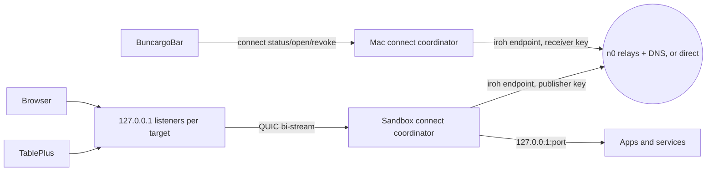

# Replace the frp relay with iroh

Status: implemented on 22 September 2026, except the Phase 1 cloud benchmark and Phase 5 release, which need a real sandbox. The user-facing result is documented in [remote.md](remote.md); this file is kept as the reasoning and the record of what was measured. The earlier Cloudflare named-tunnel plan on `t3code/replace-remote-with-cloudflare-tunnels` was the alternative and is not needed.

Four things changed from this plan while building it, all verified:

- The handshake reply is `{"type":"ok"}`, one reply shape shared with stream opens, rather than a separate `welcome`.
- Paid relays are configured with `BUNCARGO_CONNECT_RELAYS` plus an optional `BUNCARGO_CONNECT_RELAY_TOKEN`. The JavaScript bindings at 1.1.0 export no `presetIrohServices`, so there is no way to mint a capability token from an API secret in JS; a relay auth token and self-hosted or unauthenticated relays are what the bindings actually support.
- `endpoint.ts` survives: `listenLoopback` is exactly what the receiver's listeners need. `credentials.ts` was deleted instead.
- A computer that has created a receiver token keeps its coordinator running, because that is what makes it reachable. Only a publish-only computer exits on idle.

## 1. Decision

iroh can replace the whole Hetzner stack (Caddy, frps, the Bun directory, deploy pipeline) for the thing remote sharing is actually used for: a developer's Mac seeing and reaching the apps and databases of a cloud sandbox. Recommendation: do it, as a hard switch, after the Phase 1 cloud benchmark passes.

What changes for users:

| | frp today | iroh |
| --- | --- | --- |
| Who runs infrastructure | We do (Hetzner, DNS, certs, SQLite backups, deploy gate on every release) | Nobody. n0 hosts relays and discovery; iroh endpoints hold the only state. |
| Signup | None, but only because we pay for the server | None on n0's free Community tier. A customer who wants guaranteed relay capacity signs up for Iroh Services Pro ($19/month) and sets two env vars. |
| Browser apps | Public `https://<id>.connect.hanskristoffer.dk` | Local `http://127.0.0.1:<port>` on the receiving Mac, served by the connect coordinator |
| Databases | Private loopback listener | Same |
| Transport path | Always via Hetzner | Direct QUIC after hole punching, relay fallback, end-to-end encrypted either way |
| Sandbox requirements | Outbound TCP 443 and 7000 | Outbound UDP for direct paths; relay fallback is HTTPS over TCP 443 |
| Client tooling | Downloads a verified frpc binary | The `@number0/iroh` npm package (prebuilt N-API module, 13 MB per platform) |

What is lost: the public app URL. A shared run is only reachable from a computer holding the receiver identity. That is the security model we wanted anyway (the old docs had to warn that those URLs were public), and `dev --expose` quick tunnels still exist for genuinely public URLs. Phone testing goes through `buncargo sim` on the Mac.

Why not the Cloudflare plan: it keeps the Bun directory on Hetzner and requires every customer to own a Cloudflare account and a domain. iroh removes the server entirely and needs no account.

## 2. Evidence

### iroh facts, verified 22 September 2026

- iroh 1.0 shipped 15 June 2026; current release is v1.2.0 (11 September 2026). Wire protocol and language APIs are stable across 1.x. [Announcement](https://www.iroh.computer/blog/v1)
- Official Node.js bindings: `@number0/iroh` 1.1.0, N-API, prebuilt for macOS arm64, Linux x64/arm64 (glibc and musl), Windows. Node ≥ 20.3. MIT/Apache-2.0. Swift bindings exist but the bar does not need them: it keeps calling the CLI.
- Endpoints default to the n0 preset: public relays (`euc1-1.relay.n0.iroh.link` was chosen from Denmark) plus DNS discovery via `dns.iroh.link`. No signup, no keys.
- Public relays are "suitable for development and hobby use", rate-limited per connection with unpublished numbers, no uptime guarantee, and only the latest stable iroh is supported. [Relays](https://docs.iroh.computer/concepts/relays), [Rate limiting](https://docs.iroh.computer/relays/rate-limiting.md)
- Iroh Services Pro: $19/month, authenticated shared relays in four regions, 5 MB/s per connection, 100 GB egress, 10,000 concurrent endpoints. Configured per endpoint with the project's API secret, which must not be embedded in a distributed app. [Pricing](https://www.iroh.computer/pricing), [Shared relays](https://docs.iroh.computer/iroh-services/relays/shared.md)
- Relay traffic is end-to-end encrypted; relays see ciphertext only. Hole punching succeeds in "roughly 9 out of 10 network configurations"; corporate firewalls and some cellular networks fall back to relay.
- Browsers cannot dial iroh without custom WASM client code, so browser access needs a loopback listener on the receiver. That is a fixed constraint, not an option.

### Cross-machine test, 22 September 2026

A real `buncargo dev` on a Mac Mini (macOS arm64, `mac-mini-hans`) published one app to this MacBook. Both ran the built CLI; the sandbox side installed the packed tarball and nothing else.

Working, on the first run and with no configuration beyond the token:

- The run appeared in `connect status` under its name, project and branch, served at `http://127.0.0.1:62740/`.
- Three 20 MiB downloads returned byte-exact payloads, each matching the server's own SHA-256.
- SSE arrived incrementally, 200 ms apart as produced, about 54 ms behind the server's own timestamp. Nothing buffered.

Measured on that route:

| Measurement | Result |
| --- | --- |
| Time to first byte, small response (6 runs) | 104-131 ms, median 124 ms |
| 20 MiB through Buncargo (5 runs) | 7.56-7.98 s, median 7.63 s, 2.62 MiB/s |
| 20 MiB through raw iroh, same two machines | 8.31 s, 2.41 MiB/s |
| Path actually selected during the transfer | relay `euc1-1` (Frankfurt), 60-73 ms RTT |

Two conclusions, and one thing this route cannot answer.

**Buncargo adds no measurable overhead.** The raw-iroh probe was marginally *slower* than the product, so the stream bridge and its `Array<number>` conversion are not the ceiling. Whatever the transport does, the product gets.

**This was a relayed transfer throughout.** Hole punching did eventually select a direct path, but only after the transfer finished, and it chose the Tailscale address at 152 ms RTT rather than either machine's LAN address. Both machines sit on `192.168.1.0/24` and still could not reach each other directly, and their Tailscale link is itself relayed through Frankfurt, so this network has no fast path to find. 2.4-2.6 MiB/s is consistent with the documented rate limit on n0's free public relays rather than with anything in our code.

**It is not the Phase 1 gate.** The 3.00 s frp figure came from a Cursor sandbox with a cloud uplink to a dedicated Hetzner box. A home Mac Mini through a free shared relay is a different route in every term, so the two numbers do not compare. What this run does establish is the correctness of the whole path and that a relayed worst case costs about 2.5 MiB/s. If a Cursor sandbox also ends up relayed, that is a real regression against frp and the paid relays in section 3 are the answer; Phase 1 still has to measure it there.

One operational finding: the Mac Mini's resolver cached a negative answer for a receiver identity that had not published yet, and kept failing for minutes afterwards even though the record existed. The publisher's bounded backoff retries through it, so it self-heals, but a token copied into a sandbox before the receiving computer has ever run its coordinator can look broken for a few minutes.

### Spike on this Mac under Bun 1.4.2

Two endpoints in one Bun process, `@number0/iroh` 1.1.0, default n0 preset:

| Measurement | Result |
| --- | --- |
| Bind two endpoints | 32 ms |
| Dial by endpoint ID only (DNS discovery) | 83 ms, relay path first, direct path selected after hole punch |
| Dial with relay URL hint, no direct addresses | Connected, relay RTT 95 ms |
| 20 MiB over one bi-stream, 64 KiB `Array<number>` chunks | 418 ms, 47.9 MiB/s (loopback, so an upper bound on binding overhead only) |

The bindings load and run under Bun. The byte-array interface is not the bottleneck. Relay throughput from a real sandbox is the unknown; that is Phase 1.

## 3. User-facing contract

Unchanged: `BUNCARGO_CONNECT_TOKENS`, `BUNCARGO_CONNECT_NAME`, automatic publication of every selected app and service with a host port when tokens are present, local dev surviving any sharing failure, the bar's grouping by name then project, and the shared row components.

Changed:

- A token is `bc_share_<64 hex receiver endpoint ID><64 hex secret>`. It is still a credential: possession lets a sandbox publish to that Mac. It never lets anyone read the Mac's directory.
- Every target row shows a loopback URL as soon as the run is visible. Open, Copy and TablePlus act on that URL. There is no separate connect step and no "Connecting…" state.
- `connect tcp` and `connect disconnect` are removed. `connect token [--rotate]`, `connect status [--json]`, `connect open <target-id>` and `connect revoke <publisher-id>` remain.
- `BUNCARGO_CONNECT_URL` is removed. Optional `BUNCARGO_CONNECT_RELAYS` (comma-separated relay URLs) and `BUNCARGO_CONNECT_RELAY_TOKEN` (a relay auth token) select a customer's paid relays; both sides of a connection must set them because a dialer connects to the receiver's home relay. Without them the n0 public relays are used.
- Revocation is immediate: the receiver closes the publisher's connection and every bridged stream, and denies that publisher endpoint ID until the receiver file is edited. The 45-second bound disappears with the lease model.

## 4. Architecture

Roles and state:

| Side | Identity | State files under `~/.buncargo` |
| --- | --- | --- |
| Receiver (Mac) | Long-lived secret key; its public key is the receiver endpoint ID inside the token | `connect-receiver.json` (secret key, token secret, denied publisher IDs), mode 0600 |
| Publisher (sandbox) | Secret key per coordinator home so reconnects and revocation refer to a stable ID | `connect-publisher.json`, `connect-intents/<session>.json` (unchanged seam) |

One coordinator per home, as today, launched by `ensureConnectCoordinator`. The Mac coordinator is receiver only; the sandbox coordinator is publisher only; the code is one daemon that does whichever role its state calls for, because a Mac running `dev` with tokens is a publisher too.

The publisher dials each distinct recipient once and keeps that connection open. All runs whose intent names that recipient are multiplexed over it. The receiver never dials.

### Wire protocol

ALPN `buncargo/connect/1`. Messages are newline-delimited JSON validated with the existing `protocol.ts` parsers; `RunInput` and `TargetInput` keep their shape.

1. Publisher opens the control stream and sends `{"type":"hello","secret":"<64 hex>","name":"Cursor cloud","hostname":"..."}`. The receiver compares the secret in constant time, checks the denylist, and answers `{"type":"welcome"}` or closes the connection with an application error code.
2. Publisher sends `{"type":"runs","runs":[RunInput...]}` on every change and at least every 10 seconds. The receiver hides a publisher whose last message is older than 45 seconds or whose connection closed.
3. The receiver opens one bi-stream per accepted local socket, starting with `{"type":"open","sessionId":"...","targetId":"..."}`. The publisher checks the run is live in the run registry, the target's process identity still matches, and the target is ready; then connects to `127.0.0.1:<port>`, replies `{"type":"ok"}` and bridges bytes with `ForwardSockets`. Any failure replies `{"type":"error","message":"..."}` and finishes the stream.

QUIC gives per-stream flow control, so an idle database connection and a Vite HMR WebSocket on the same connection do not block each other. A small adapter turns a `SendStream`/`RecvStream` pair into a Node `Duplex` so the existing bridge and half-close behaviour are reused unchanged.

### Receiver listeners

For every target of every visible run the receiver binds one loopback listener on a free port and keeps it while the run is visible. HTTP targets get `http://127.0.0.1:<port>`; TCP targets get the same connection-string derivation as `visitors.ts` does today (postgresql/redis/clickhouse from preset and `tablePlusUrl`). Ports stay stable for the life of the coordinator; a run that disappears releases its listeners and destroys its open sockets.

Named `.localhost` hosts for remote apps through the hosts daemon are a possible follow-up once the loopback URLs prove annoying (cookie sharing between apps on one origin). Not in this change.

### Browser traffic

The browser talks to `127.0.0.1:<port>` on the Mac; bytes are bridged unchanged to `127.0.0.1:<port>` in the sandbox. The Host header is `127.0.0.1:<mac port>`, which Vite's host check always allows, so no `allowedHosts` or Host rewriting is needed. HMR stays origin-relative through `buncargoVite()`. SSE, WebSockets and uploads stream because nothing parses HTTP in the path. HTTP compression previously added in Caddy goes away; the QUIC path is encrypted but not compressed, and Vite dev output is what it is. Re-measure rather than reintroduce compression.

### Lifecycle and failure

- The connection is the lease. No renewals, no server clock, no idempotency keys.
- Publisher reconnects with the existing bounded exponential backoff and jitter on connection loss; a reconnect resends `hello` and the full `runs` list.
- Target stop, port change or process identity change closes that target's bridged streams on the publisher side before the next `runs` message hides it.
- Receiver revoke: close connection, destroy streams and listeners, persist the publisher ID in `denied`. Token rotation replaces the secret; already-connected publishers stay connected until revoked, matching today's documented behaviour.
- Coordinator SIGKILL: listeners and sockets die with the process; the peer sees the connection close. No child processes exist any more, so `child-guard.ts` is deleted.
- Idle exit stays at 60 seconds with no intents and no visible runs.

### Bundling the native module

`connectd.js` is copied out of the package into `~/.buncargo/bin` so the bar can run it after bunx cache eviction. A `.node` addon cannot be inlined, so `installConnectBundle` also copies the platform addon (`iroh.<platform>.node` from the `@number0/iroh-<platform>` package) next to the bundle as `iroh-<hash>.node`, and the daemon loads it with `require` of that path instead of the package loader. `verify-package.ts` keeps its "detached daemon outside the checkout" check and extends it to the addon. The CLI itself never imports iroh; only the daemon does, so startup cost is unchanged.

`@number0/iroh` becomes a normal dependency. Its platform packages are optionalDependencies of that package, so a consumer install fetches one 13 MB addon.

## 5. Code removal and replacement map

| Existing | Change |
| --- | --- |
| `server/` (directory, store, http, main, tests, `deploy/*`) | Delete. |
| `.github/workflows/deploy-connect.yml`, `deploy-connect` job and `needs` in `release.yml`, `frp` job in `ci.yml` | Delete. Publication no longer waits for a server gate. |
| `scripts/verify-connect.ts`, `scripts/verify-connect-compression.ts` | Delete. |
| `src/core/connect/binary.ts`, `frpc.ts`, `child-guard.ts` (+ test), `frp.integration.test.ts`, `gate.ts` (+ test), `client.ts`, `visitors.ts`, `endpoint.ts` | Delete. The gate's ownership check moves into the stream handler; the visitor URL derivation moves into the receiver listener module. |
| `src/core/connect/protocol.ts` | Drop `CONNECT_ORIGIN`, `Relay`, `Assignment`, `PublicationLease`, `VisitorLease`, `parseDirectory` URL-suffix rules. Add the three message types, token encode/decode, and loopback URL validation. |
| `src/core/connect/publisher.ts` | Rewrite around one endpoint and one connection per recipient; keep `runTargets` and the process-identity checks. |
| New `src/core/connect/receiver.ts`, `stream.ts` | Accept loop, hello/denylist, listeners, stream-to-duplex adapter. |
| `src/core/connect/daemon.ts` | Same shape: lock, loopback status API, intents refresh; wire publisher and receiver in-process. |
| `src/cli/commands/connect.ts` | Remove `tcp`/`disconnect`; `revoke` takes a publisher ID; `token` generates locally. |
| `src/core/runtime-flags.ts` (+ tests) | Remove `connectOrigin`, `frpTestsEnabled`, `BUNCARGO_CONNECT_URL`; new token regex; add relay vars; keep `connectProcessEnv` stripping tokens and the relay secret from app processes. |
| `src/core/connect/bundle.ts`, `scripts/verify-package.ts` | Copy the addon next to the bundle; verify it. |
| `menubar/.../ConnectionDirectory.swift` | Remove `origin`, `connections`; every target carries a loopback `url`; validate `http://127.0.0.1:<port>/` or a database scheme on `127.0.0.1`. |
| `menubar/.../ConnectionStore.swift`, `RemoteViews.swift` | Remove `connections`, `connecting`, `disconnect`, `tcp`; Open/Copy/TablePlus use `target.url` directly. |
| `menubar/Tests/ConnectionTests.swift`, `menubar/fixtures/connect.v1.json` | Regenerate from the new schema. |
| `package.json` | Add `@number0/iroh`; remove `test:integration-frp`; add `test:integration-iroh`. |
| `docs/frp.md`, `frp-replacement-plan.md`, `frp-acceptance.md` | Deleted. `docs/remote.md` replaces them; there is no operator runbook any more. |
| `readme.md`, `AGENTS.md`, `menubar/README.md` | Replace every frp/Hetzner mention (24 lines today). |

Grep gate at the end: `frp`, `frps`, `frpc`, `connect.hanskristoffer.dk`, `178.104.193.175`, `Caddy`, `BUNCARGO_CONNECT_URL`, `stcp`, `visitor` in active source, scripts, workflows and docs. Only the changelog and git history keep them.

Operator cleanup, once, after release: stop and remove the three systemd units, the Cloudflare DNS token, the wildcard DNS records, the Hetzner firewall rules, the GitHub deploy SSH secret, and the backup timer. Then retire the server.

## 6. Phases and gates

### Phase 1 — prove the transport from a real sandbox

Write a 200-line throwaway script using `@number0/iroh` directly: receiver on the Mac with a loopback listener bridging to a stream; publisher in a Cursor cloud sandbox bridging the stream to a local Vite (the Lullu app) and Postgres. Record for each run whether the selected path was direct or relay (`Connection.paths()`), then repeat the 10 September benchmark: 20 MiB file, uncached Lullu load event and heading, three alternated runs each, plus a real HMR edit, an SSE subscription and a Postgres query.

Gate: median no worse than 20% slower than the recorded frp numbers (3.00 s / 5.46 s / 7.48 s) on whichever path the sandbox gets. If the relay path is the one used and it fails the gate, repeat with Iroh Services Pro relays on both sides. If that also fails, stop here and keep frp; do not ship a hybrid.

Also confirm: UDP egress from the sandbox (direct path possible at all), the addon loads on Linux x64 glibc under Bun, and idle connections survive 30 minutes without traffic.

### Phase 2 — protocol, publisher, receiver

Implement `protocol.ts` changes, the duplex adapter, publisher and receiver, and the daemon wiring. Unit tests: token encode/decode and redaction, hello rejection paths (wrong secret, denied ID, malformed), `runs` filtering per recipient, listener lifecycle, stream open validation against process identity, backpressure and half-close through the adapter. Integration test with two in-process endpoints over loopback (like the spike) covering HTTP request/response, SSE, WebSocket upgrade echo, raw TCP echo, revoke closing an open stream, and target stop closing streams.

Gate: two publishers and two receivers see only their authorized runs; revoking one publisher cannot affect the other; killing a coordinator leaves no listener behind.

### Phase 3 — CLI, bar, bundling

Rewrite the connect command, Swift models and store, fixtures, `bundle.ts` addon copy, `verify-package.ts`. Test on a fresh macOS receiver and a fresh Linux sandbox using only env tokens.

Gate: BuncargoBar shows the run under its name and branch, Open loads the app with working HMR, TablePlus opens Postgres, Redis works, all without any server or manual configuration.

### Phase 4 — delete

Everything in section 5, in the same PR. Run build, lint, `bun test`, `verify:package`, the new integration test and `swift test`. Conventional breaking-change title (`feat!: replace the frp relay with iroh`), release-please computes the version.

### Phase 5 — release and retire the server

Merge, release, confirm a fresh `bunx buncargo` install shares a sandbox to a Mac, then do the operator cleanup above. Update `docs/release-flow-plan.md` to remove the deploy gate.

## 7. Risks

- Public relay rate limit is unpublished and can be tuned down at any time. Mitigation: Phase 1 measures it; the Pro env vars are the escape hatch and cost the customer, not us.
- n0 supports only the latest stable iroh on public relays. Keep `@number0/iroh` current with Renovate or release-please dependency bumps; a stale pin can lose relay access.
- Cloud sandboxes with no UDP egress always relay. Phase 1 tells us whether that is fast enough; nothing else does.
- A 13 MB native dependency in a library package. Acceptable because the platform packages are optional and only the daemon loads the addon.
- Bun N-API compatibility regressions. The spike passed on Bun 1.4.2; the integration test in CI catches future breaks on both Linux and macOS.
