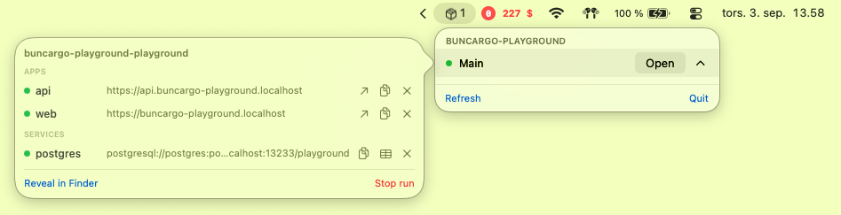

# BuncargoBar

A macOS menu bar app that lists the `buncargo dev` runs active on this machine:
every project, every worktree, every app and service, with one click to open the
main app, copy a connection string, open a database in TablePlus, or stop
something.



It reads `~/.buncargo/runs.json`, which `buncargo dev` writes and keeps current.
No Docker call, no config load, no git — the app is a reader, and every action
that changes something shells out to `buncargo stop`.

## Install

```bash
bunx buncargo bar install
```

`buncargo dev` also offers it once, the first time it runs on a Mac that does
not have it. Answering `n` there means it never asks again; `buncargo bar reset`
undoes that.

## Build from source

Needs the Xcode command line tools (Swift 6, macOS 14+).

```bash
bash menubar/scripts/install.sh     # build, install to /Applications, open
bash menubar/scripts/package.sh     # build the .app bundle only
bash menubar/scripts/launch.sh      # open an installed copy
```

## Troubleshooting

```bash
/Applications/BuncargoBar.app/Contents/MacOS/BuncargoBar --status
```

Prints one line per run and exits. If this says `no active runs` while
`buncargo runs` shows some, the two are reading different registries — check
`HOME`.

| Problem | Fix |
| --- | --- |
| Menu is empty | Run `buncargo runs`. If that is empty too, no run has published itself yet. |
| App will not open from Finder | `bash menubar/scripts/launch.sh` clears the quarantine flag. |
| No TablePlus button | Only shown when TablePlus is installed, and only for database services. |
| An app shows a named `https://` URL that 404s | The hosts daemon is not serving it; `buncargo hosts status`. |

## Layout

```
Sources/BuncargoBar/
  App.swift          # MenuBarExtra scene, --status mode, stop confirmations
  RunRegistry.swift  # runs.json v1 model, liveness, project grouping
  RunStore.swift     # directory watch + 5s poll, published state
  Views.swift        # rows, hover detail panel, status dots
  Actions.swift      # open/copy/TablePlus, and `buncargo stop` invocation
fixtures/
  runs.v1.json       # schema contract, checked by Swift and TypeScript tests
scripts/
  package.sh         # build + bundle (VERSION/BUILD_NUMBER from the env)
  install.sh         # package --install --open
  launch.sh          # open, clearing quarantine
  smoke-test.sh      # --status against the fixture; runs in CI
```

## Releasing

Tag `bar-v<version>`; `.github/workflows/release-menubar.yml` builds a universal
bundle, smoke-tests it, and publishes `BuncargoBar-<version>.zip` plus a
`.sha256`. `buncargo bar install` downloads exactly those assets. Signing and
notarization happen only when the Apple secrets are configured; without them the
ad-hoc signed bundle ships and the installer clears the quarantine attribute.
